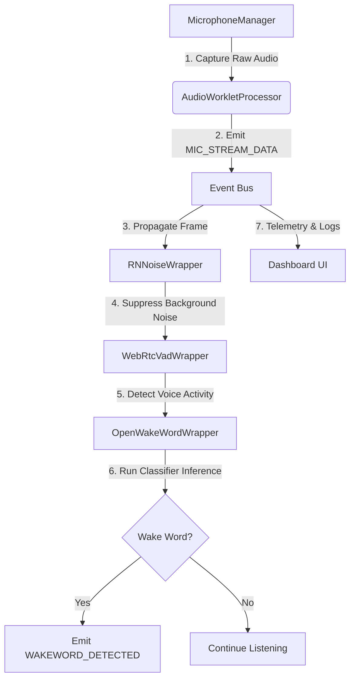

# Wake Word Detection Hub

A modular, production-ready, and entirely open-source JavaScript architecture for real-time Wake Word Detection in the browser. 

This project integrates browser Web Audio APIs, WebAssembly noise suppression (RNNoise), Voice Activity Detection (WebRTC VAD), and neural network inference (ONNX Runtime Web running an OpenWakeWord model) through a decoupled, event-driven architecture.

---

## Architecture Overview

The system uses a pipeline pattern where audio frames flow from the microphone to the wake word classifier. Communication between modules is decoupled using an application-wide **Event Bus**.



### Folder Structure

```text
/
├── eslint.config.js     # ESLint Flat Config rules for modern ES modules
├── index.html           # Application DOM entry page and mount target
├── package.json         # Build dependencies, scripts, and engine specs
├── vite.config.js       # Vite bundler options, including COOP/COEP headers
└── src/
    ├── main.js          # App bootstrapper and pipeline controller
    ├── style.css        # Premium Glassmorphism UI styling
    ├── audio/
    │   ├── microphone.js    # Web Audio API mic wrapper (Permissions & AudioContext)
    │   └── audio-worklet.js # Real-time audio rendering thread frame bundler
    ├── dsp/
    │   └── rnnoise.js       # WebAssembly RNNoise noise suppression wrapper
    ├── events/
    │   └── event-bus.js     # Decoupled publish-subscribe communications hub
    ├── ui/
    │   └── dashboard.js     # User status dashboard, charts, and logging console
    ├── utils/
    │   ├── constants.js     # Shared sampling rate, frame sizes, and events
    │   └── logger.js        # Timestamp-formatted logging module
    ├── vad/
    │   └── webrtc-vad.js    # WebRTC Voice Activity Detection wrapper
    └── wakeword/
        └── openwakeword.js  # ONNX Runtime Web OpenWakeWord inference session
```

---

## Current Milestone

Currently, this repository represents the **Foundation & Architecture scaffolding** milestone. 
- All project configuration, build systems (Vite), and linters (ESLint) are fully configured.
- Folder hierarchies and modular placeholder classes are set up with defined interface boundaries.
- The UI dashboard renders real-time performance meters, module badges, and scrollable logs connected to the event bus.
- Pipeline modules are linked together in `src/main.js` using event listeners ready for implementation.

---

## Installation & Setup

1. **Install Dependencies**:
   ```bash
   npm install
   ```

2. **Run Development Server**:
   ```bash
   npm run dev
   ```

3. **Code Quality / Linting**:
   ```bash
   npm run lint
   ```

4. **Compile Production Bundle**:
   ```bash
   npm run build
   ```

---

## Future Roadmap & Modules Implementation

This project is built iteratively, implementing and testing one module at a time to ensure stability:

1. **Milestone 1 (Current)**: Project Scaffolding, Event Bus, and UI Dashboard.
2. **Milestone 2**: Microphone & AudioWorklet capture pipeline integration (Web Audio API).
3. **Milestone 3**: RNNoise WebAssembly integration for client-side noise suppression.
4. **Milestone 4**: WebRTC VAD wrapper compilation and speech state detection.
5. **Milestone 5**: ONNX Runtime Web setup, OpenWakeWord model caching, and classification.
6. **Milestone 6**: End-to-end integration testing, visualizer upgrades, and final deployment.

---

## Known Limitations

- **Cross-Origin Security**: Because the pipeline will run multi-threaded WebAssembly in production, the server must supply COOP (`Cross-Origin-Opener-Policy: same-origin`) and COEP (`Cross-Origin-Embedder-Policy: require-corp`) headers (already configured in `vite.config.js`).
- **Sample Rate Locking**: The models require exactly `16000Hz` mono PCM input. Browsers with alternate internal sample rates require resampling inside the Web Audio graph.
- **WASM Support**: Devices running old web views without WebAssembly/AudioWorklet support will fall back gracefully.

---

## Performance Goals

- **Latency**: End-to-end audio chunk processing latency `< 45ms`.
- **CPU Overhead**: Average CPU usage under `8%` on modern mobile devices.
- **Accuracy**: Wake word true-positive detection rate `> 95%` in environments with moderate background noise (`SNR > 10dB`).
