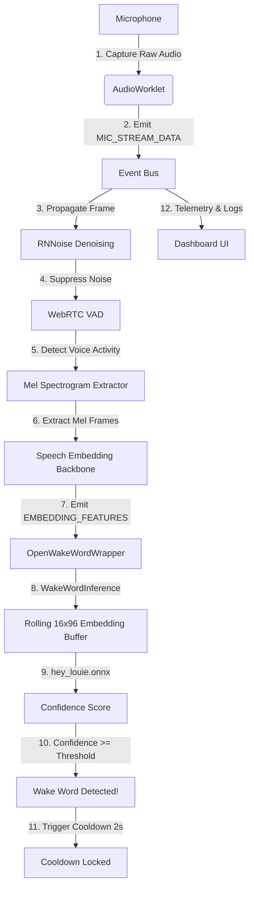

# Wake Word Detection Hub

A modular, production-ready, and entirely open-source JavaScript architecture for real-time Wake Word Detection in the browser. 

This project integrates browser Web Audio APIs, WebAssembly noise suppression (RNNoise), Voice Activity Detection (WebRTC VAD), and neural network inference (ONNX Runtime Web running an OpenWakeWord model) through a decoupled, event-driven architecture.

---

## Architecture Overview

The system uses a pipeline pattern where audio frames flow from the microphone to the wake word classifier. Communication between modules is decoupled using an application-wide **Event Bus**.

### Data Flow Pipeline


### Folder Structure

```text
/
├── eslint.config.js     # ESLint Flat Config rules for modern ES modules
├── index.html           # Application DOM entry page and mount target
├── package.json         # Build dependencies, scripts, and engine specs
├── vite.config.js       # Vite bundler options, including COOP/COEP headers
├── netlify.toml         # Production security headers configuration
└── src/
    ├── main.js          # App bootstrapper and pipeline controller
    ├── style.css        # Premium Glassmorphism UI styling
    ├── audio/
    │   ├── microphone.js    # Web Audio API mic wrapper (Permissions & AudioContext)
    │   └── audio-worklet.js # Real-time audio rendering thread frame bundler
    ├── dsp/
    │   └── rnnoise.js       # WebAssembly RNNoise noise suppression wrapper
    ├── events/
    │   └── event-bus.js     # Decoupled publish-subscribe communications hub
    ├── ui/
    │   └── dashboard.js     # User status dashboard, charts, and logging console
    ├── utils/
    │   ├── constants.js     # Shared sampling rate, frame sizes, and events
    │   └── logger.js        # Timestamp-formatted logging module
    ├── vad/
    │   └── webrtc-vad.js    # WebRTC Voice Activity Detection wrapper
    └── wakeword/
        ├── openwakeword.js  # Coordinates downloads, caches, and event flow
        ├── model-loader.js  # Downloads model buffers with local-to-remote fallback
        ├── inference.js     # ONNX session runner & temporal embedding buffer
        ├── mel-spectrogram.js # Runs melspectrogram.onnx dynamically
        └── speech-embedding.js # Runs embedding_model.onnx dynamically
```

---

## Current Status & Milestones

All development phases for the pipeline are complete:
- **Phase 1 Complete**: Microphone & AudioWorklet capture pipeline integration.
- **Phase 2 Complete**: RNNoise WebAssembly integration for noise suppression.
- **Phase 3 Complete**: WebRTC VAD wrapper compilation and speech state detection.
- **Phase 4 Complete**: Custom "Hey Louie" Classifier integration running Mel Spectrogram features into a Speech Embedding backbone and a classification model.

### Dataset & Training Status
- The current production classifier (`hey_louie.onnx`) was initially trained using **synthetic data** generated from Text-to-Speech (TTS) voices.
- Speaker-independent evaluation on the test set revealed a relatively high false-negative rate (meaning the wake word is sometimes missed in real-world human scenarios).
- **Next Step**: Collecting **real human recordings** from a diverse pool of speakers to retrain the classifier head and improve robustness.
- **Validation Rule**: The existing production model must not be replaced unless a newly trained model demonstrates objective improvements on speaker-independent test splits while keeping False Positive Rates (FPR) under `5.0%`.

---

## Installation & Setup

1. **Install Dependencies**:
   ```bash
   npm install
   ```

2. **Run Development Server**:
   ```bash
   npm run dev
   ```

3. **Code Quality / Linting**:
   ```bash
   npm run lint
   ```

4. **Compile Production Bundle**:
   ```bash
   npm run build
   ```

5. **Train / Evaluate Model**:
   ```bash
   python scripts/train_wakeword.py
   ```

---

## Known Constraints & Architecture Details

- **Security Headers Required**: Because the pipeline runs multi-threaded WebAssembly in production, the host server must supply COOP (`Cross-Origin-Opener-Policy: same-origin`) and COEP (`Cross-Origin-Embedder-Policy: require-corp`) headers. This is handled by `vite.config.js` in development and `netlify.toml` in production Netlify deployments.
- **Sample Rate Locking**: The models require exactly `16000Hz` mono PCM input. Browsers with alternate internal sample rates require resampling inside the Web Audio graph.
- **Dynamic Node Names**: The browser-side ONNX Runtime Web wrapper dynamically resolves input and output tensor node names from the model files instead of using hardcoded assumptions.
- ** authoritativeness of Latency**: Performance latency timings displayed in the dashboard represent the actual ONNX session execution duration (`session.run` call) rather than wrapper/scheduling times.

